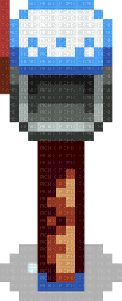

  
  
  

<h6 align="center">🪔 Tenho 22 anos.   🪔 Estou cursando o 4º período em Análise e Desenvolvimento de Sistemas.  🪔  Atualmente, desempenho funções na área de suporte ao cliente, sobretudo no setor administrativo.</h6>

  

  
  
  
  
  
  

   

  
  

